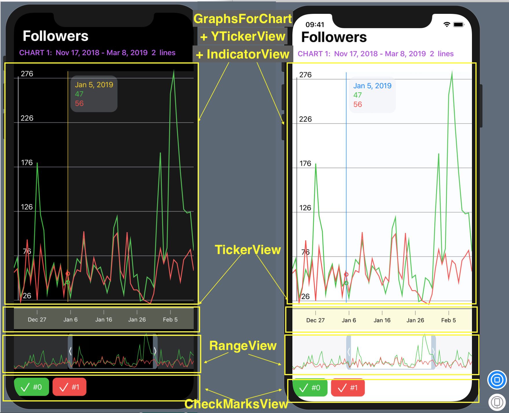
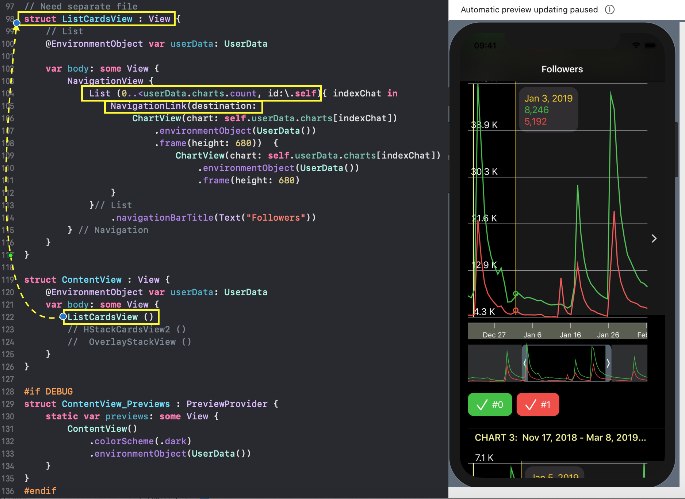
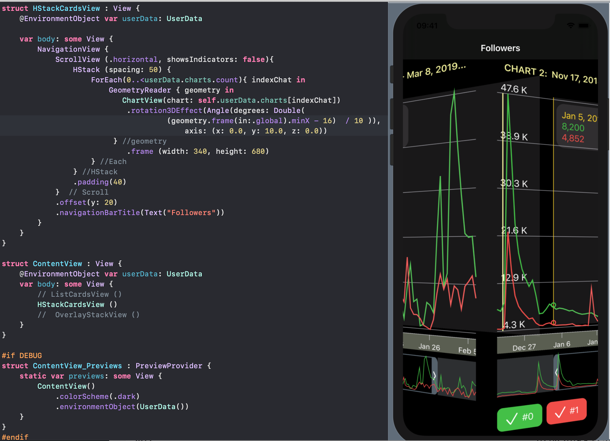
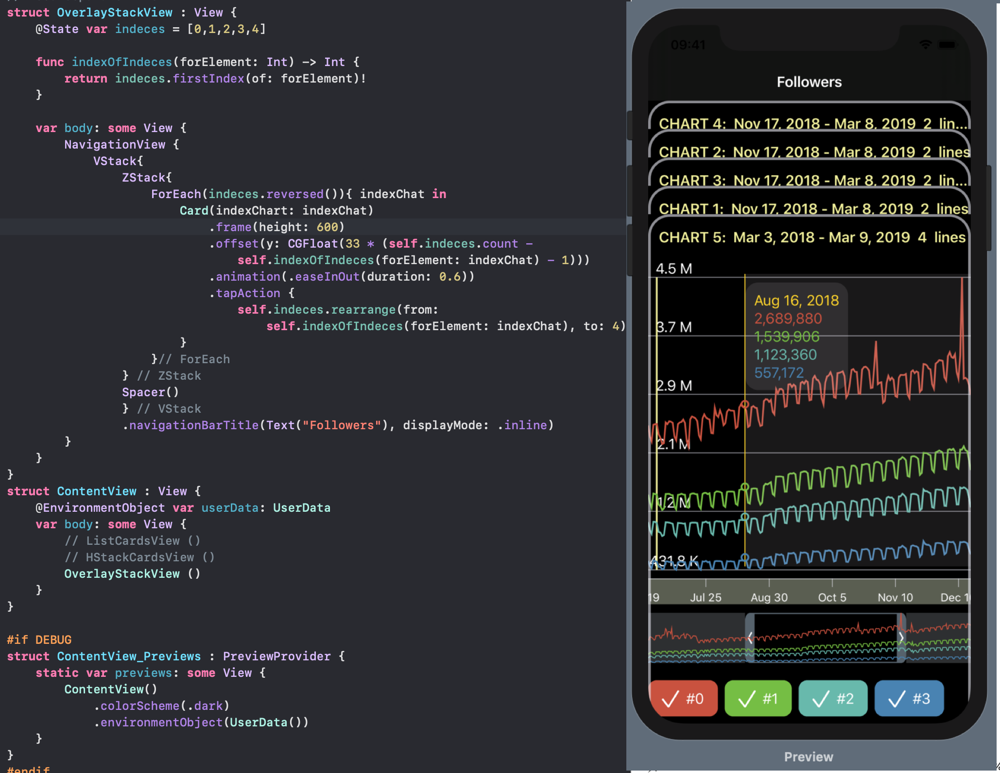

# Charts with SwiftUI

For this app Xcode 11 Beta 7 and MacOS Catalina Beta 7 are required.
 

## which consists of:

-  GraphsForChart,
-  YTickerView, 
-  IndicatorView,
-  TickerView, 
-  RangeView, 
-  CheckMarksView.

## Combines several charts in three ways 

- List
- HStack with rotation3DEffect
- ZStack of CardViews

More to come!

